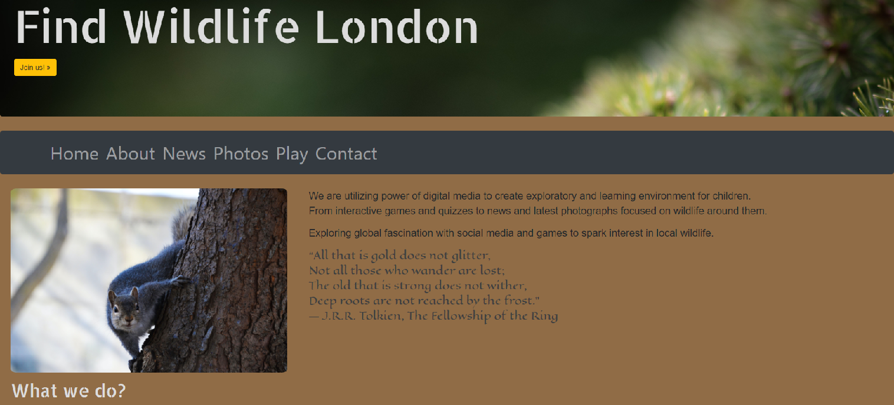

# Find Wildlife London
:cherry_blossom::deciduous_tree::maple_leaf::herb:
 
URL: https://melitamf.github.io/Find-Wildlife-London/index.html
 
:honeybee::beetle::rabbit::mouse:
 
* Category: Educational resource
* Aim: Entertaining and educating children
* Produced as part of CFG Hack from Home
  https://findcollabs.com/hackathon/cfg-hack-from-home-3rcp30fbxbfbezyiqkst

## Table of contents
* [General info](#general-info)
* [Screenshots](#screenshots)
* [Technologies](#technologies)
* [Setup](#setup)
* [Features](#features)
* [Status](#status)
* [Contributors](#contributors)
* [Contact](#contact)

## General info
* Target group: children 5 – 11 years and parents, nature/wildlife enthusiasts :baby:
* Rationale: During lockdown children are even more detached from nature than before. Web page containing seasonal London wildlife (plants, flowers, bugs and animals) could provide learning and entertainment platform.

## Screenshots

## Technologies
* C#
* CSS
* HTML
* JavaScript
* Visual studio

## Setup
Not needed, page used technologies above. Games need to be downloaded as we cannot host them yet.

## Code Examples
Not needed, project is public. :unlock:

## Features
List of features ready an
* Entertainment Video 
* Educational Materials 
* Educational Games
* And many more ...

Done:
* UI/ UX - The graphical represntation of the App/ Platform
* Front-end - The interface 
* Back-end - The Logic area
* Testing 
* Hosting 

To do List:
* Hosting game
* Building quiz to recognise typical wildlife in UK
* Making an App for this

## Status
Project is: _done but could be developed further_ :bulb:

##Improvements/Limitations
The games are not mobile ready yet, and could this could be part of the Version 2 of the Games. Currently the games are a MVP ( minimum viable product).

## Contributors
* [@Arsomeree](https://github.com/Arsomeree)
* [@elisabenaglia](https://github.com/elisabenaglia)
* [@tannypandey](https://github.com/tannypandey)
* [@MelitaMF](https://github.com/MelitaMF)

Mentor:
* [@HussienElSawy](https://github.com/HussienElSawy)

## Contact
Contact me :) [@MelitaMF](https://github.com/MelitaMF) :mailbox_with_mail:
